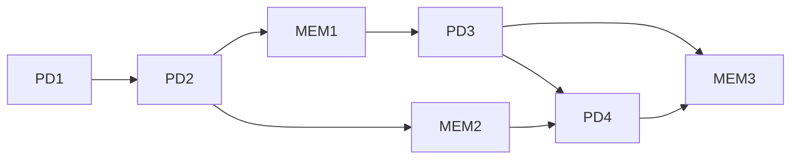

# Learning With Errors-based Public Key Encryption Key Generation in seL4
This repository is part of PhD research.  It demonstrates using the microkit API to create an isolated key management system.  

**NOTE:** current implementation does not reflect the image below. 

## Protection Domains
We have developed three (4) protection domains (PD): 
1. (PD1) key generation request (client.c): this client provides no functionality either than to use the notify() entry point to the key generating server in order to start the key generating process. This protection domain will be removed at a later date.
2. (PD2) key generating server (server.c): the server begins generating asymmetric keys based on a learning with errors (LWE) public key encryption scheme.  The keys are generated according to the mathematics described below.  After generationg, they are written to a virtual memory space that is shared with the key consumer.  Thereafter, the server uses the notify() entry point to tell the key consumer that the keys are ready.
3. (PD3) public key consumer (pk_consumer.c): the public key consumer waits until it is notified by the key generation server.  Once notified, the public key consumer reads from the shared memory space.  Using the public key, we encrypt a single bit according to LWE encryption algorith.  The resulting ciphertext is printed to a shared memory region between PD3 and PD4.  Afte the ciphertext is written, notify() is used to tell PD4 to read from the shared memory region.
4. (PD4) secret key consumer (sk_consumer.c): the secret key consumer waits until it is notified by the key generation server.  Once notified, the secret key consumer reads from the shared memory space and prints the secret key.  PD4 is notified from PD3 to read and print the ciphertext from the shared memory region.
5. (PD5) LWE operations (LWE_operations.c): this PD is where we will be performing homomorphic operations on ciphertexts. current implementation only reads from the shared memory between the encryption.c and the decryption.c

